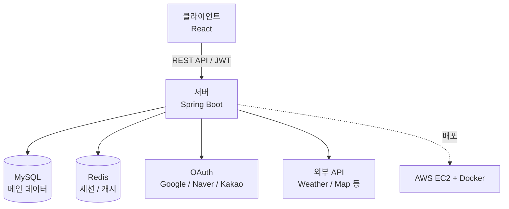

<div align="center">

# Project</br>fitmate

이용자들의 운동 지속을 위한 커뮤니티, 체계적 회원 관리, 맞춤형 컨텐츠 제공하는 </br>
구독 서비스 및 커뮤니티 기반 고객관리 플랫폼


<br>


</div>

<br/>


<div align="center">

[기획 배경](#기획배경) &nbsp;|&nbsp;
[주요 기능](#주요-기능) &nbsp;|&nbsp;
[화면 미리보기](#화면-미리보기) &nbsp;|&nbsp;
[기술 스택](#기술-스택) &nbsp;|&nbsp;
[아키텍처](#아키텍처) &nbsp;|&nbsp;
[개발 툴](#개발-툴) &nbsp;|&nbsp;
[협업 도구](#협업-도구) &nbsp;|&nbsp;
[사용방법](#사용방법) &nbsp;|&nbsp;
[API](#api) &nbsp;|&nbsp;
[Troubleshooting](#troubleshooting) &nbsp;|&nbsp;
[Team](#team) &nbsp;|&nbsp;
[프로젝트 구조](#프로젝트-구조) &nbsp;|&nbsp;
[후기](#후기) &nbsp;|&nbsp;
[License](#license)

</div>

## 기획배경

사람들에게 운동을 지속적으로 하지못하는 이유와 필요로 하는 부분에 대해 설문을 한 결과<br/>
대다수의 사람들은 동기 부족과 운동정보 부족이 주된 원인으로 답했고, 필요한 기능으로 운동 루틴 생성과 정보 제공이라고 답하였습니다.<br/>
그렇기에 저희는 동기 부여와 정보의 공유를 위한 커뮤니티, 헬스장 및 PT와 연결되는 구독, 루틴을 생성해주는 서비스 기반의 프로젝트를 제작하였습니다.

<details open>
<summary><h2 id="주요-기능">:star2: 주요 기능</h2></summary>

**구독을 통한 헬스장 및 PT 접근**
- 구독을 통해 헬스장 및 PT에 대한 접근이 쉬워짐

**커뮤니티 (자유게시판 / 운동게시판)**
- 자유게시판 및 운동게시판 구분으로 운동동기와 정보 공유에 접근성이 쉬움

**루틴 생성**
- 부위별, 장비별 루틴을 맞출 수 있고, GIF 자료를 통해 하는 방법을 볼 수 있음

</details>

## 화면 미리보기

| 메인 페이지 | 커뮤니티 | 루틴 생성 |
|:---:|:---:|:---:|
|  |  | |

<details open>
<summary><h2 id="기술-스택">기술 스택</h2></summary>

**프론트 (Frontend)**<br/>


**백 (Backend)**<br/>


**저장소 (Database)**<br/>


**배포 (Deployment)**<br/>


</details>

## 아키텍처



<details open>
<summary><h2 id="개발-툴">개발 툴</h2></summary>


</details>

<details open>
<summary><h2 id="협업-도구">협업 도구</h2></summary>


카카오톡으로 실시간 소통, 스프레드시트로 진행 상황 및 일정 공유, GitHub로 코드 및 이슈 관리를 진행했습니다.

</details>

## 사용방법

프로젝트는 `frontend/`, `backend/`로 구성되어 있으며, Docker Compose로 한 번에 실행하거나 각각 따로 실행할 수 있으나 Docker Compose로 실행하는 방법만 설명합니다.

### Docker Compose로 실행

```bash
git clone https://github.com/lhstk114@gmail.com/fitmate.git
cd fitmate
cp .env.example .env   # 환경변수 설정 후
docker-compose up -d
```

브라우저에서 `http://localhost:3000` 접속

<details open>
<summary><h2 id="Environment Variables">:star2: 환경변수 설정</h2></summary>

`.env.example` 파일을 참고하여 `.env` 파일을 생성하세요.

```
# 로컬 .env
# 실제 로컬 환경에서는 이 파일을 복사하여 .env로 사용
# EC2 배포 환경에서는 깃 secret에 작성된 키 값을 가져와서 새로 .env를 만들어서 사용됨
# MySQL
MYSQL_DATABASE=fitmate_db
MYSQL_ROOT_PASSWORD=

# RabbitMQ
RABBITMQ_DEFAULT_USER=admin
RABBITMQ_DEFAULT_PASS=

# Kakao API
KAKAO_ADMIN_KEY=
KAKAO_MAP_KEY=

# Google Translate API
GOOGLE_TRANSLATE_API_KEY=

# ExerciseDB API
EXERCISEDB_API_KEY=

# OpenWeather API
OPENWEATHER_API_KEY=

# Google OAuth2
GOOGLE_CLIENT_ID=
GOOGLE_CLIENT_SECRET=

# Naver OAuth2
NAVER_CLIENT_ID=
NAVER_CLIENT_SECRET=

# Kakao OAuth2
KAKAO_CLIENT_ID=
KAKAO_CLIENT_SECRET=

# Jwt 시크릿 키
JWT_SECRET_KEY=

#DOCKER_HUB 유저이름
DOCKERHUB_USERNAME=

#서버 URL
FRONT_SERVER_URL=localhost:3000
BACKEND_API_SERVER_URL=localhost:8090
```
</details>

<details open>
<summary><h2 id="api">API</h2></summary>

**연동 API**

| 분류 | API |
|------|-----|
| 날씨 | OpenWeather API |
| 운동 정보 | ExerciseDB API |
| 번역 | Google Cloud Translation API |
| 결제/계좌 | KakaoBank API |
| 지도 | KakaoMap API |

**OAuth 2.0**

Google, Naver, Kakao 소셜 로그인을 지원합니다.


## Troubleshooting

<details>
<summary>개발 중 겪었던 기술적 이슈</summary>

**이슈:** 문제 상황 설명

**원인:** 원인 분석

**해결:** 어떻게 해결했는지 설명

</details>

## Team

| 이름 | 담당 내용 |
|-------|-----------|
| 이XX </br>(팀장) | 페이지구조 설계, 메인페이지, 캘린더, 카카오맵, CI/CD, GIT 관리 |
| 김XX | 회원기능<br/>- 시큐리티, JWT 기반 인증/인가<br/>- 챗봇 FAQ<br/>- 파일저장기능 공통화 |
| 이현성 | 게시판<br/>- 게시글 CRUD<br/>- 댓글 CRUD<br/><br/>관리자 페이지<br/>- 탭 별 게시글 관리 기능<br/>- 게시글 상세 모달기능<br/>- 게시글 개별 삭제, 선택삭제 기능 구현<br/>- 탭 및 카테고리 CRUD<br/><br/>루틴<br/>- 부위 장비 선택 후 운동루틴 생성<br/>- 루틴결과에서 사진보기를 통해 GIF 파일 오픈 클로즈 토글<br/>- 루틴내역에서 이전 결과 클릭 시 내역 불러오기 (최대 5개까지만 저장) |
| 김XX | 쇼핑몰<br/>- 상품조회 및 주문 결제<br/>- 구독 서비스<br/>- PT 예약<br/>- 관리자 페이지 상품 CRUD, 주문내역 조회 |

## 프로젝트 구조

<details>
<summary>폴더 구조 보기</summary>

| 전체 | 프론트 | 백 |
|------|--------|-----|
| docker-compose.yaml<br/>.env | Dockerfile<br/>nginx.conf<br/>- apis<br/>&nbsp;&nbsp;- auth, member, shop, util<br/>- components<br/>admin<br/>auth<br/>chatbot<br/>common<br/>community<br/>exercise<br/>member<br/>shop<br/>trainer<br/>- css<br/>- layout<br/>- page<br/>- router<br/>- store | - admin<br/>- calandar<br/>- chatbot<br/>- common<br/>- community<br/>- config<br/>- exception<br/>- exercise<br/>- file<br/>- main<br/>- map<br/>- member<br/>- shop<br/>- trainer<br/>- weather<br/>Dockerfile |

| ERD |
| ------ |
|  |

</details>

## 후기

<details>
<summary>프로젝트를 통해 배운 점</summary>

- 배운 점 : 1차 프로젝트를 작업할 때는 프론트만으로 구현을 해서 신경써야할 부분이 적었는데 백엔드를 같이 구현하게 되며 신경써야할 부분이 늘었고 실수를 통해 빠르게 배우게 되었다
- 아쉬운 점 / 다음에 시도해보고 싶은 것 : 현재 권한별 행동범위 설정을 구현하지 못한 상태로 추가할 예정

</details>

## License

이 프로젝트는 [MIT License](LICENSE)를 따릅니다.
